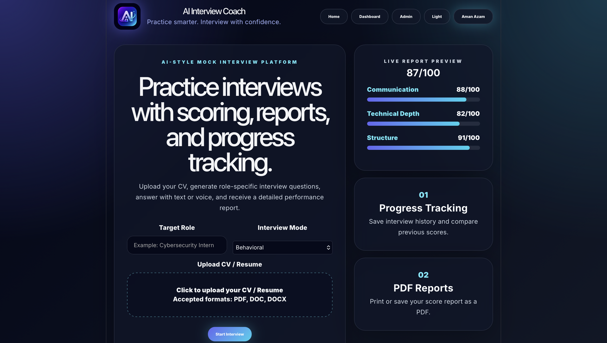
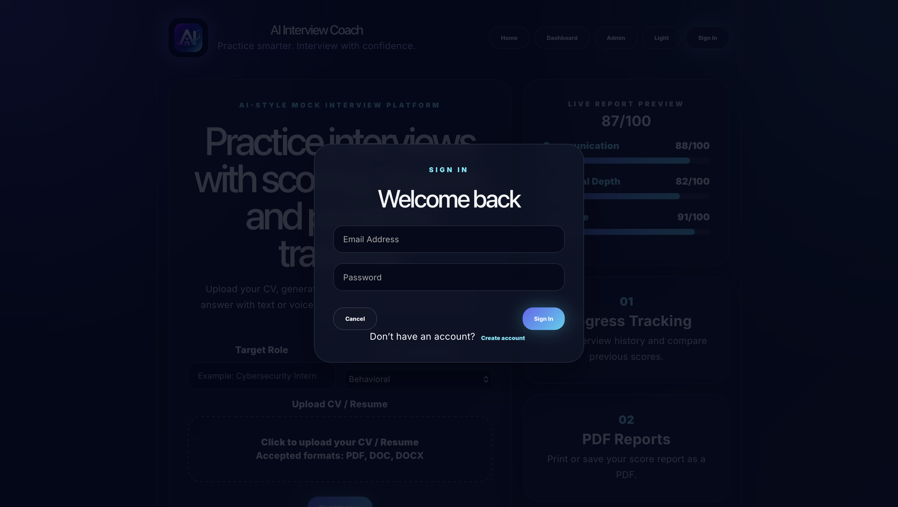
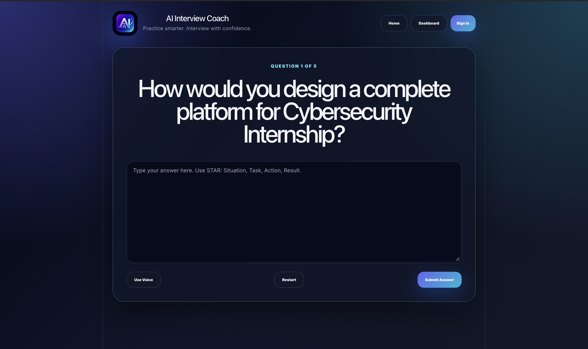
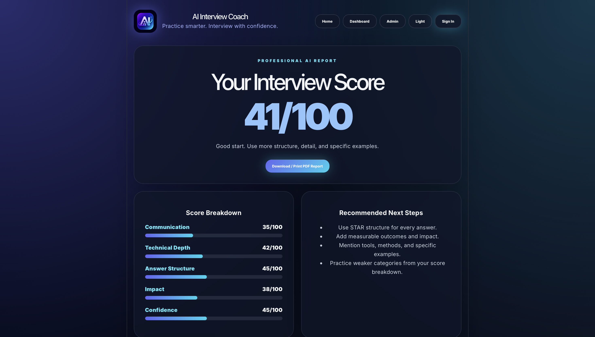
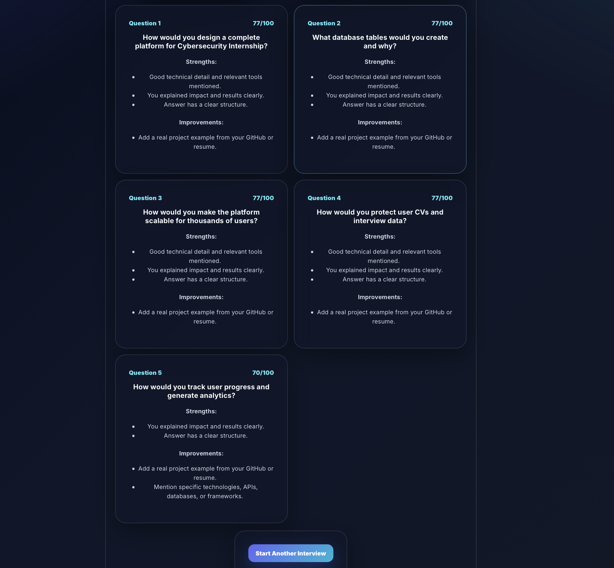

# AI Interview Coach

AI Interview Coach is an AI-powered mock interview platform that helps job seekers prepare for interviews through resume-based question generation, role-specific interview modes, automated scoring, detailed feedback, and downloadable performance reports.

## Live Demo

https://interview-pre-hub.vercel.app/

---

## Features

- AI-powered interview question generation using Gemini AI
- CV / Resume upload and analysis
- Role-specific interview preparation
- Technical Interview mode
- Behavioral Interview mode
- System Design Interview mode
- Text and Voice answer support
- Automated interview scoring
- Detailed AI-generated feedback
- Performance breakdown by category
- Progress tracking dashboard
- Downloadable PDF interview reports
- Modern responsive UI
- Dark / Light mode support

---

## Screenshots

### Home Page

### User Authentication

### Interview Session

### AI Interview Report

### Detailed Feedback Analysis

---

## How It Works

1. Enter a target role.
2. Select an interview mode (Technical, Behavioral, or System Design).
3. Upload your CV / Resume.
4. Gemini AI generates personalized interview questions based on your resume and selected role.
5. Answer questions using text or voice.
6. Receive an AI-generated interview score and feedback report.
7. Review strengths, weaknesses, and improvement recommendations.
8. Download your performance report as a PDF.

---

## Supported Interview Modes

### Technical Interview
Focuses on technical knowledge, programming concepts, problem solving, and role-specific technologies.

### Behavioral Interview
Evaluates communication, teamwork, leadership, adaptability, and workplace scenarios.

### System Design Interview
Assesses architecture, scalability, databases, APIs, and system design decision-making.

---

## Tech Stack

### Frontend
- React
- Vite
- JavaScript
- CSS

### AI
- Google Gemini API

### Additional Libraries
- PDF.js
- jsPDF

### Deployment
- Vercel

---

## Installation

Clone the repository:

bash git clone https://github.com/Aman-Azam/AI-Interview-Coach.git 

Navigate to the project:

bash cd AI-Interview-Coach 

Install dependencies:

bash npm install 

Run locally:

bash npm run dev 

---

## Environment Variables

Create a .env file in the root directory:

env VITE_GEMINI_API_KEY=your_gemini_api_key 

---

## Future Improvements

- User authentication with persistent accounts
- Cloud database integration
- Interview history analytics
- Real-time AI feedback during interviews
- Enhanced speech-to-text support
- Multi-language interview support
- Recruiter dashboard

---

## Author

Aman Azam

GitHub: https://github.com/Aman-Azam

Live Demo: https://interview-pre-hub.vercel.app/